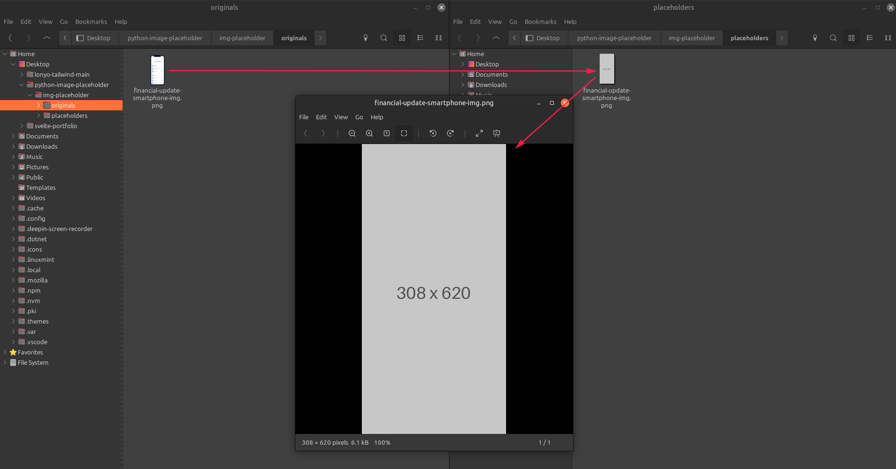

# ⚡ Python Image Placeholder

<div align="center">

[](https://github.com/JHShovon/python-image-placeholder/stargazers)

[](https://github.com/JHShovon/python-image-placeholder/network)

[](https://github.com/JHShovon/python-image-placeholder/issues)

[](LICENSE)

**A simple command-line tool to generate placeholder images using Python.**

</div>

## 📖 Overview

This Python script generates placeholder images of specified dimensions and color. It's designed for quick prototyping and development, providing a simple way to fill image slots with visually representative placeholders without needing external resources.  The tool is command-line driven for easy integration into workflows.


## ✨ Features

- Generates placeholder images with customizable dimensions.
- Sets a solid background color for the placeholder.
- Simple command-line interface for ease of use.
- Outputs images in PNG format.


## 🖥️ Screenshots




## 🛠️ Tech Stack

- **Language:** Python


## 🚀 Quick Start

### Prerequisites

- Python 3.x (Specific version not explicitly stated, but 3.x is assumed based on common Python usage)
- Pillow library (`pip install Pillow`)


### Installation

1. **Clone the repository:**
   ```bash
   git clone https://github.com/JHShovon/python-image-placeholder.git
   cd python-image-placeholder
   ```

2. **Install dependencies:**
   ```bash
   pip install Pillow
   ```

## 📁 Project Structure

```
└── python-image-placeholder/
    ├── command-line.txt
    ├── python-placeholder-image-generate.png
    ├── README.md
    └── img-placeholder/
        ├── generate.py
        ├── placeholders/
        │   ├── sample-img-1.jpg
        │   └── sample-img-2.jpg
        └── originals/
            ├── sample-img-1.jpg
            └── sample-img-2.jpg
```
## Installation
Download [Python](https://www.python.org/downloads/) and install it.

then install pillow from command line

```bash
python3 install python3-pillow
```
For linux
```bash
apt install python3-pillow
```
## How to generate palceholder
If all installation requirement completed, copy your images and paste it "originals" folder
```
python-image-placeholder/img-placeholder/originals
```
Now run a command line
```bash
python3 img-placeholder/generate.py
```

## 🤝 Contributing

Contributions are welcome! Please open an issue or submit a pull request.

## 📄 License

This project is licensed under the MIT License - see the [LICENSE](LICENSE) file for details.  (Note: No LICENSE file found in provided repository data.  This needs to be added)

---

<div align="center">

**Made with ❤️ by JHShovon**

</div>

